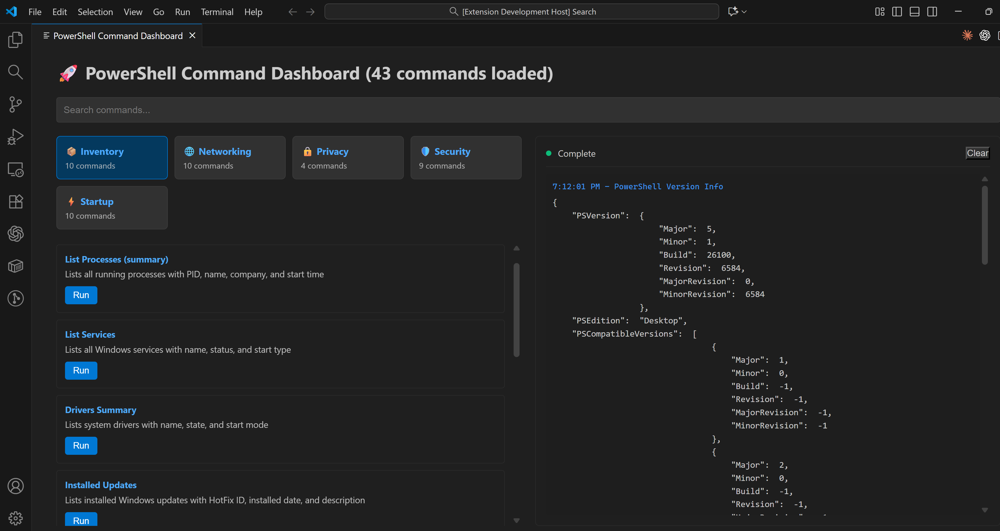

# PowerShell Command Dashboard

A VS Code extension that provides a visual dashboard for running curated PowerShell commands with transparency and security.

## Features

- 🚀 **Visual Dashboard** - Clean, modern two-panel UI for browsing and executing PowerShell commands
- 📦 **Dynamic Command Loading** - Commands loaded from JSON pack files, easy to extend
- 🔒 **Security First** - Command whitelisting, risk levels, and admin requirements clearly marked
- 📊 **Real-time Output** - Live command execution with results displayed in terminal-style panel
- 🎯 **40+ Built-in Commands** - Pre-configured system administration commands across 4 categories
- 🔍 **Search & Filter** - Quickly find commands with real-time search
- ❌ **Process Control** - Cancel running commands and clear output history
- 🎨 **VS Code Integration** - Follows VS Code theme and UI guidelines



## Quick Start

1. Clone and install dependencies:
   ```bash
   git clone https://github.com/Sustainable-IQ/powershell_command_dashboard.git
   cd powershell_command_dashboard
   pnpm install
   pnpm run build
   ```

2. Press **F5** in VS Code to launch the Extension Development Host

3. In the new VS Code window, open Command Palette (`Ctrl+Shift+P`)

4. Run: **"PowerShell: Open Dashboard"**

5. Browse commands by category, click "Run" to execute

## Architecture

The extension uses three main components:

1. **Extension Host** (`out/extension-dynamic.js`) - Dynamically loads command packs and handles VS Code integration
2. **Command Packs** (`src/catalog/packs/*.json`) - JSON files defining PowerShell commands with metadata
3. **Dashboard UI** - Generated dynamically from command packs, includes search, categories, and live output

## Available Command Categories

- **📦 System Inventory** - Process lists, services, drivers, disk usage, system info
- **🌐 Networking** - Network adapters, connectivity tests, configuration
- **🔒 Privacy** - Telemetry settings, privacy configuration
- **⚡ Startup** - Boot configuration, startup programs

## Adding Custom Commands

### Method 1: Edit Existing Pack Files

Add commands to any JSON file in `src/catalog/packs/`:

```json
{
  "id": "check-battery",
  "label": "Battery Status",
  "category": "System Inventory",
  "description": "Check battery health and charge level",
  "commandText": "Get-WmiObject Win32_Battery | Select EstimatedChargeRemaining",
  "requiresAdmin": false,
  "riskLevel": "info"
}
```

### Method 2: Create New Pack File

Create a new JSON file in `src/catalog/packs/` with your command collection.

After adding commands:
1. Run `pnpm run build` to copy packs to output
2. Reload VS Code window (Ctrl+R in Extension Host)
3. Your commands appear automatically in the dashboard

## Development

### Project Structure

```
powershell_command_dashboard/
├── src/                      # TypeScript source
│   ├── catalog/packs/       # Command pack JSON files
│   └── extension.ts         # Original extension entry
├── out/                     # Compiled JavaScript
│   ├── extension-dynamic.js # Current dynamic loader
│   └── catalog/packs/      # Copied command packs
├── dist/                    # Built webview assets
└── webview/                 # React dashboard source
```

### Key Files Modified During Development

- `out/extension-dynamic.js` - Dynamic command pack loader (replaced hardcoded commands)
- `out/extension-enhanced.js` - Enhanced version with security features
- `dist/webview/index.html` - Dashboard UI with results panel

## Requirements

- **OS**: Windows 10/11
- **PowerShell**: Windows PowerShell 5.1 or PowerShell 7+
- **VS Code**: 1.85.0 or higher
- **Node.js**: 18+ (for development)
- **pnpm**: Package manager

## Security Features

- ✅ Command whitelisting - only pre-approved commands can run
- ✅ Risk level indicators (info/modify/critical)
- ✅ Admin elevation requirements clearly marked
- ✅ No arbitrary code execution
- ✅ Commands validated against pack definitions

## License

MIT

## Author

Luc - [Sustainable-IQ](https://github.com/Sustainable-IQ)

## Repository

https://github.com/Sustainable-IQ/powershell_command_dashboard
